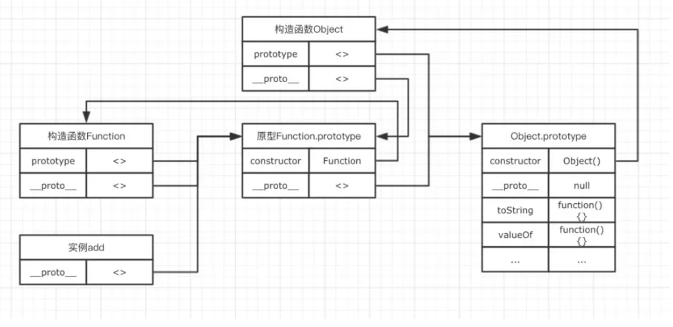

## this指向

首先，我们先来回顾一下执行上下文的生命周期


首先，我们需要得出一个非常重要的，并且一定要牢记于心的结论，**this的指向，是在函数被调用的时候确定的。**也就是执行上下文被创建时确定的。

因此，一个函数中的this指向，可以非常灵活。比如下面的例子中，同一个函数由于调用方式的不同，this指向了不一样的对象。


```javascript
var a = 10;
var obj = {
  a: 20
}

function fn() {
  console.log(this.a);
}

fn(); // 10
fn.call(obj); // 20
```

除此之外，**在函数执行过程中，this一旦被确定，就不可更改了。**

```javascript

var a = 10;
var obj = {
  a: 20
}

function fn() {
  this = obj; // 这句话试图修改this，运行后会报错
  console.log(this.a);
}

fn();
```

### 函数中的this

在总结函数中this指向之前，我们有必要通过一些奇怪的例子，来感受一下函数中this的捉摸不定。

```javascript

// demo01
var a = 20;
function fn() {
  console.log(this.a);
}
fn();

// demo02
var a = 20;
var obj = {
  a: 10,
  c: this.a + 20,
  fn: function () {
    return this.a;
  }
}

console.log(obj.c);
console.log(obj.fn());
```

分析之前，我们直接了当抛出结论。

在一个函数上下文中，this由调用者提供，由调用函数的方式来决定。**如果调用者函数，被某一个对象所拥有，那么该函数在调用时，内部的this指向该对象。如果函数独立调用，那么该函数内部的this，则指向undefined**。但是在非严格模式中，当this指向undefined时，它会被自动指向全局对象。

但是我们需要特别注意的是demo02。在demo02中，对象obj中的c属性使用`this.a + 20`来计算。这里我们需要明确的一点是，单独的`{}`不会形成新的作用域，因此这里的`this.a`，由于并没有作用域的限制，它仍然处于全局作用域之中。所以这里的this其实是指向的window对象

那么我们修改一下demo03的代码，大家可以思考一下会发生什么变化。

 ```javascript

'use strict';
var a = 20;
function foo() {
  var a = 1;
  var obj = {
    a: 10,
    c: this.a + 20,
    fn: function () {
      return this.a;
    }
  }
  return obj.c;
}
console.log(foo());    // ？
console.log(window.foo());  // ?
 ```

再来看一些容易理解错误的例子，加深一下对调用者与是否独立运行的理解。

 ```javascript
var a = 20;
var foo = {
  a: 10,
  getA: function () {
    return this.a;
  }
}
console.log(foo.getA()); // 10

var test = foo.getA;
console.log(test());  // 20
 ```

`foo.getA()`中，getA是调用者，他不是独立调用，被对象foo所拥有，因此它的this指向了foo。而`test()`作为调用者，尽管他与foo.getA的引用相同，但是它是独立调用的，因此this指向undefined，在非严格模式，自动转向全局window。

### 使用call，apply显示指定this

JavaScript内部提供了一种机制，让我们可以自行手动设置this的指向。它们就是call与apply。所有的函数都具有这两个方法。它们除了参数略有不同之外，其功能完全一样。它们的第一个参数都为this将要指向的对象。

如下例子所示。fn并非属于对象obj的方法，但是通过call，我们将fn内部的this绑定为obj，因此就可以使用this.a访问obj的a属性了。这就是call/apply的用法。

```javascript

function fn() {
  console.log(this.a);
}
var obj = {
  a: 20
}

fn.call(obj);
```

call与apply后面的参数，都是向将要执行的函数传递参数。其中call以一个一个的形式传递，apply以数组的形式传递。这是他们唯一的不同。

```javascript

function fn(num1, num2) {
  console.log(this.a + num1 + num2);
}
var obj = {
  a: 20
}

fn.call(obj, 100, 10); // 130
fn.apply(obj, [20, 10]); // 50
```

## 闭包

**闭包是一种特殊的对象。**

**它由两部分组成。执行上下文(代号A)，以及在该执行上下文中创建的函数（代号B）。**

**当B执行时，如果访问了A中变量对象中的值，那么闭包就会产生。**

**在大多数理解中，包括许多著名的书籍，文章里都以函数B的名字代指这里生成的闭包。而在chrome中，则以执行上下文A的函数名代指闭包。**

因此我们只需要知道，一个闭包对象，由A、B共同组成，接下来我们以chrome的标准来称呼。

```javascript

// demo01
function foo() {
  var a = 20;
  var b = 30;

  function bar() {
    return a + b;
  }

  return bar;
}

var bar = foo();
bar();
```

上面的例子，首先有执行上下文foo，在foo中定义了函数bar，而通过对外返回bar的方式让bar得以执行。当bar执行时，访问了foo内部的变量a，b。因此这个时候闭包产生

上节课中我们讲到JavaScript拥有自动的垃圾回收机制，关于垃圾回收机制，有一个重要的行为，那就是，当一个值，在内存中失去引用时，垃圾回收机制会根据特殊的算法找到它，并将其回收，释放内存。

而我们知道，函数的执行上下文，在执行完毕之后，生命周期结束，那么该函数的执行上下文就会失去引用。其占用的内存空间很快就会被垃圾回收器释放。可是闭包的存在，会阻止这一过程。

先来一个简单的例子。

```javascript

var fn = null;
function foo() {
  var a = 2;
  function innnerFoo() {
    console.log(a);
  }
  fn = innnerFoo; // 将 innnerFoo的引用，赋值给全局变量中的fn
}

function bar() {
  fn(); // 此处的保留的innerFoo的引用
}

foo();
bar(); // 2
```

在上面的例子中，`foo()`执行完毕之后，按照常理，其执行环境生命周期会结束，所占内存被垃圾收集器释放。但是通过`fn = innerFoo`，函数innerFoo的引用被保留了下来，复制给了全局变量fn。这个行为，导致了foo的变量对象，也被保留了下来。于是，函数fn在函数bar内部执行时，依然可以访问这个被保留下来的变量对象。所以此刻仍然能够访问到变量a的值。

这样，我们就可以称foo为闭包。

**所以，通过闭包，我们可以在其他的执行上下文中，访问到函数的内部变量。**比如在上面的例子中，我们在函数bar的执行环境中访问到了函数foo的a变量

> 注：虽然例子中的闭包被保存在了全局变量中，但是闭包的作用域链并不会发生任何改变。在闭包中，能访问到的变量，仍然是作用域链上能够查询到的变量。

```javascript

var fn = null;
function foo() {
  var a = 2;
  function innnerFoo() {
    console.log(c); // 在这里，试图访问函数bar中的c变量，会抛出错误
    console.log(a);
  }
  fn = innnerFoo; // 将 innnerFoo的引用，赋值给全局变量中的fn
}

function bar() {
  var c = 100;
  fn(); // 此处的保留的innerFoo的引用
}

foo();
bar();
```

### 闭包的应用场景

##### 柯里化

在函数式编程中，利用闭包能够实现很多炫酷的功能，柯里化便是其中很重要的一种。

##### 模块化

模块化是闭包最强大的一个应用场景。

```javascript

(function () {
        var a = 10;
        var b = 20;

        function add(num1, num2) {
            var a1 = num1 ? num1 : a;
            var b1 = num2 ? num2 : b;

            return a1 + b1;
        }

        window.add = add;
    })();

    add(10, 20);
```

## 事件循环

我们知道JavaScript的一大特点就是单线程，而这个线程中拥有唯一的一个事件循环。

JavaScript代码的执行过程中，除了依靠函数调用栈来搞定函数的执行顺序外，还依靠任务队列(task queue)来搞定另外一些代码的执行。


- 一个线程中，事件循环是唯一的，但是任务队列可以拥有多个。
- 任务队列又分为macro-task（宏任务）与micro-task（微任务），在最新标准中，它们被分别称为task与jobs。
- macro-task大概包括：script(整体代码), setTimeout, setInterval, setImmediate
- micro-task大概包括: process.nextTick, Promise
- setTimeout/Promise等我们称之为任务源。而进入任务队列的是他们指定的具体执行任务。

```javascript
// setTimeout中的回调函数才是进入任务队列的任务
setTimeout(function() {
    console.log('xxxx');
})
// setTimeout作为一个任务分发器，这个函数会立即执行，而它所要分发的任务，也就是它的第一个参数，才是延迟执行

```

- 来自不同任务源的任务会进入到不同的任务队列。其中setTimeout与setInterval是同源的。
- 事件循环的顺序，决定了JavaScript代码的执行顺序。它从script(整体代码)开始第一次循环。之后全局上下文进入函数调用栈。直到调用栈清空(只剩全局)，然后执行所有的micro-task。当所有可执行的micro-task执行完毕之后。循环再次从macro-task开始，找到其中一个任务队列执行完毕，然后再执行所有的micro-task，这样一直循环下去。
- 其中每一个任务的执行，无论是macro-task还是micro-task，都是借助函数调用栈来完成。

```javascript
setTimeout(function() {
    console.log('timeout1');
})

new Promise(function(resolve) {
    console.log('promise1');
    for(var i = 0; i < 1000; i++) {
        i == 99 && resolve();
    }
    console.log('promise2');
}).then(function() {
    console.log('then1');
})

console.log('global1');
```

首先，事件循环从宏任务队列开始，这个时候，宏任务队列中，只有一个script(整体代码)任务。每一个任务的执行顺序，都依靠函数调用栈来搞定，而当遇到任务源时，则会先分发任务到对应的队列中去，所以，上面例子的第一步执行如下图所示


第二步：script任务执行时首先遇到了setTimeout，setTimeout为一个宏任务源，那么他的作用就是将任务分发到它对应的队列中。


第三步：script执行时遇到Promise实例。Promise构造函数中的第一个参数，是在new的时候执行，因此不会进入任何其他的队列，而是直接在当前任务直接执行了，而后续的.then则会被分发到micro-task的Promise队列中去。

因此，构造函数执行时，里面的参数进入函数调用栈执行。for循环不会进入任何队列，因此代码会依次执行，所以这里的promise1和promise2会依次输出。


script任务继续往下执行，最后只有一句输出了globa1，然后，全局任务就执行完毕了。

第四步：第一个宏任务script执行完毕之后，就开始执行所有的可执行的微任务。这个时候，微任务中，只有Promise队列中的一个任务then1，因此直接执行就行了，执行结果输出then1，当然，他的执行，也是进入函数调用栈中执行的。


第五步：当所有的micro-tast执行完毕之后，表示第一轮的循环就结束了。这个时候就得开始第二轮的循环。第二轮循环仍然从宏任务macro-task开始。


这个时候，我们发现宏任务中，只有在setTimeout队列中还要一个timeout1的任务等待执行。因此就直接执行即可。执行完后宏任务队列与微任务队列中都没有任务了，所以代码就不会再输出其他东西了。

## 面向对象

### 一、对象的定义

在ECMAScript-262中，对象被定义为**“无序属性的集合，其属性可以包含基本值，对象或者函数”**。

也就是说，在JavaScript中，对象无非就是由一些列无序的`key-value`对组成。其中value可以是基本值，对象或者函数。

```javascript

// 这里的person就是一个对象
var person = {
    name: 'Tom',
    age: 18,
    getName: function() {},
    parent: {}
}
```

#### 创建对象

我们可以通过new的方式创建一个对象。

```javascript
var obj = new Object();
```

也可以通过对象字面量的形式创建一个简单的对象。

```javascript
var obj = {};
```

当想要给我们创建的简单对象添加方法时，可以这样表示

```javascript

// 可以这样
var person = {};
person.name = "TOM";
person.getName = function() {
    return this.name;
}
// 也可以这样
var person = {
    name: "TOM",
    getName: function() {
        return this.name;
    }
}
```

当我们想要访问他的name属性时，可以用如下两种方式访问。

```javascript
person.name

// 或者
person['name']
```

###  二、构造函数

```javascript
var Person = function(name, age) {
    this.name = name;
    this.age = age;
    this.getName = function() {
        return this.name;
    }
}

var p1 = new Person('Nick', 60);
console.log(p1.getName());  // Nick
```

- 与普通函数相比，构造函数并没有任何特别的地方，首字母大写只是我们约定的小规定，用于区分普通函数；

- new关键字让构造函数具有了与普通函数不同的许多特点，而new的过程中，执行了如下过程：

  1.声明一个中间对象；

  2.将该中间对象的原型指向构造函数的原型；

  3.将构造函数的this，指向该中间对象；

  4.返回该中间对象，即返回实例对象。

### 三、原型

我们创建的每一个函数，都可以有一个prototype属性，该属性指向一个对象。这个对象，就是我们这里说的原型。

  当我们在创建对象时，可以根据自己的需求，选择性的将一些属性和方法通过prototype属性，挂载在原型对象上。而每一个new出来的实例，都有一个`__proto__`属性，该属性指向构造函数的原型对象，通过这个属性，让实例对象也能够访问原型对象上的方法。因此，当所有的实例都能够通过`__proto__`访问到原型对象时，原型对象的方法与属性就变成了共有方法与属性。

我们通过一个简单的例子与图示，来了解构造函数，实例与原型三者之间的关系。

```javascript

// 声明构造函数
function Person(name, age) {
    this.name = name;
    this.age = age;
}

// 通过prototye属性，将方法挂载到原型对象上
Person.prototype.getName = function() {
    return this.name;
}

var p1 = new Person('tim', 10);
var p2 = new Person('jak', 22);
console.log(p1.getName === p2.getName); // true
```


通过图示我们可以看出，构造函数的prototype与所有实例对象的`__proto__`都指向原型对象。而原型对象的constructor指向构造函数。


**当我们访问实例对象中的属性或者方法时，会优先访问实例对象自身的属性和方法。**

```javascript

function Person(name, age) {
    this.name = name;
    this.age = age;
    this.getName = function() {
        console.log('this is constructor.');
    }
}

Person.prototype.getName = function() {
    return this.name;
}

var p1 = new Person('tim', 10);

p1.getName(); // this is constructor.
```

### 四、原型链

原型链就是多个对象通过 `__proto__` 的方式连接了起来。

```javascript
function add() {}
```

下图来表示这个函数的原型链。



其中add是Function对象的实例。而Function的原型对象同时又是Object的实例。这样就构成了一条原型链。原型链的访问，其实跟作用域链有很大的相似之处，他们都是一次单向的查找过程。因此实例对象能够通过原型链，访问到处于原型链上对象的所有属性与方法

### 五、继承

```javascript
function Person(name, age) {
    this.name = name;
    this.age = age;
}
Person.prototype.getName = function() {
    return this.name;
}


// 构造函数的继承
function cPerson(name, age, job) {
    Person.call(this, name, age);
    this.job = job;
}

// 继承原型
cPerson.prototype = new Person(name, age);
// 添加更多方法
cPerson.prototype.getLive = function() {}

```

## 作业

待补充